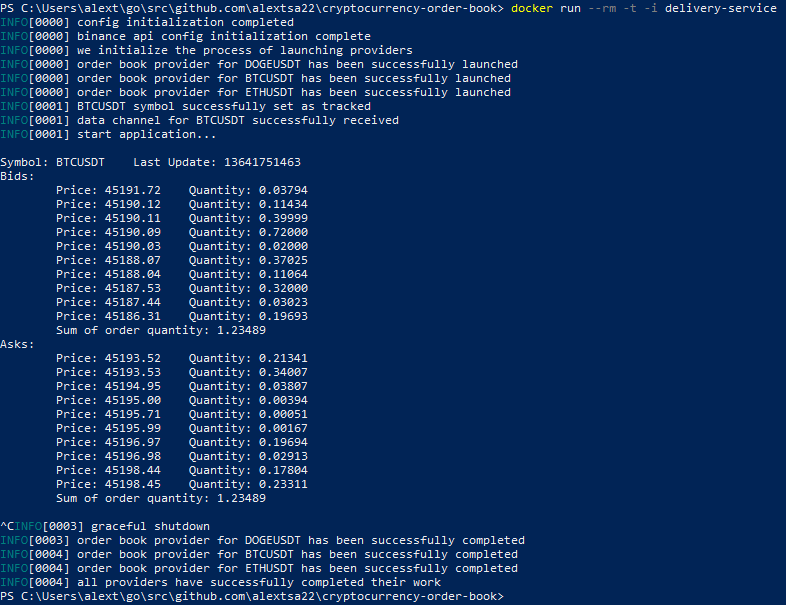

# Cryptocurrency Order Book

Task description
----------------


It is necessary to obtain the BID and ASK order books using the open API of the BINANCE exchange. The number of orders in each order book is 15. For each order book, calculate the sum of the volumes of orders in it. For each order book, order data and total order quantities are displayed.
Then display the resulting information in a convenient format.

**Data collection method:**
* ✅`Low level`: Using the REST protocol at a rate of 1 request / sec.
* ✅`High level`: Continuous over the WebSocket protocol.

**Display method:**
* ✅`Low level`: In cmd.
* 🔲`High level`: In a web browser.

Installation
------------

To run, you need to install [Docker](https://docs.docker.com/).

You must make a copy of the vendor dependencies before using [Dockerfile.dev](Dockerfile.dev).
This can be done using the command:

```
go mod vendor
```

Running
-------

To run the application, run the commands:

```
make build & make run
```

Or you can use docker commands directly:

```
docker build -t delivery-service .
```

```
docker run --rm -t -i delivery-service
```

Run Dev:

```
docker build -t delivery-service -f Dockerfile.dev .
```

### Note

You can stop the program with ```Ctrl + C```.

Example
-------

Launch with delivery over websockets:

<p align="center">
    
</p>
